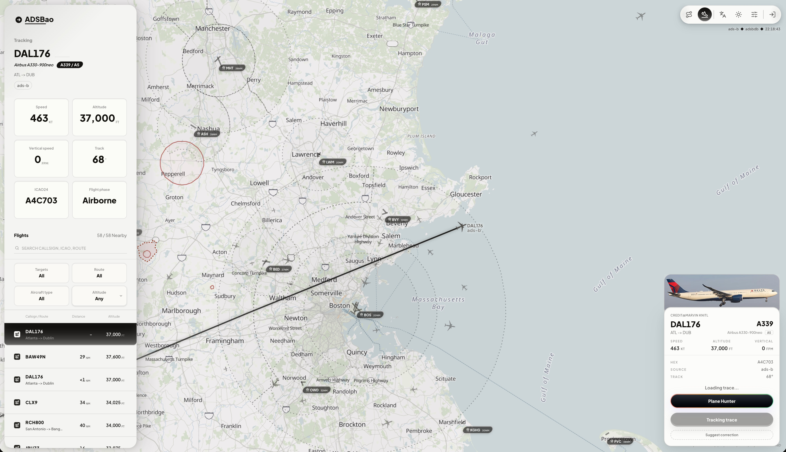

# ADSBao

<p align="center">
  <strong>Airport weather, live ADS-B traffic, and flight route context in a map-first aviation dashboard.</strong><br />
  Search airports by ICAO, IATA, city, or name, then explore METAR weather,
  nearby aircraft, runways, airspace overlays, route hints, and selected-flight
  traces from one web console.
</p>

<p align="center">
  <a href="https://adsbao.dev"><strong>Open ADSBao</strong></a>
  ·
  <a href="https://adsbao.dev/airport/KBOS">KBOS airport map</a>
  ·
  <a href="https://adsbao.dev/about">Data sources</a>
  ·
  <a href="https://github.com/orriduck/ADSBao">GitHub</a>
</p>

<p align="center">
  
</p>

<p align="center">
  
  
</p>

## Why ADSBao

ADSBao is an open-source aviation web app for people who want airport context
and live flight-tracking context without jumping between separate tools. It is
useful for plane spotting, airport discovery, weather checks, route context,
and exploring public aviation data in a visual map interface.

ADSBao is not a certified navigation product. Treat all weather, traffic,
airspace, runway, route, and map data as reference context only.

## Airport And Flight Tracking Features

- **Airport search**: Find airports by ICAO, IATA, city, or airport name.
- **Airport weather dashboard**: Read METAR-derived flight rules, wind,
  visibility, ceiling, pressure, local weather, and raw METAR text.
- **Live ADS-B traffic map**: See nearby aircraft around the airport with
  altitude, speed, heading, route hints, and aircraft-type display.
- **Runway and aviation overlays**: Explore runway geometry, range rings,
  nearby airports, airspaces, reporting points, obstacles, frequencies, and
  navaids where data is available.
- **Flight tracker pages**: Open `/aircraft/[callsign]` to follow a selected
  aircraft with live position state, telemetry, recent trace, nearby traffic,
  route labels, and last-known behavior when a signal drops.
- **Route lookup and correction feedback**: Resolve callsign routes through
  same-origin server routes, with adsbdb as the public route source and
  account-gated FlightAware fallback for enabled users.

## Live Examples

- Production site: [adsbao.dev](https://adsbao.dev)
- Airport traffic dashboard: [KBOS on ADSBao](https://adsbao.dev/airport/KBOS)
- Featured indexed airport pages: [KLAX](https://adsbao.dev/airport/KLAX),
  [KJFK](https://adsbao.dev/airport/KJFK),
  [KORD](https://adsbao.dev/airport/KORD),
  [KSFO](https://adsbao.dev/airport/KSFO), and
  [KSEA](https://adsbao.dev/airport/KSEA)
- Flight tracker route pattern: `https://adsbao.dev/aircraft/[callsign]`

## Data Sources And API Paths

ADSBao combines public aviation weather, ADS-B aircraft positions, airport
directory data, map tiles, and route context behind same-origin Next.js API
routes. See [docs/architecture.md](docs/architecture.md) for the current
feature/API boundary conventions and deployment topology.

High-frequency ADS-B aircraft updates flow through the Railway-hosted Go
realtime backend in [services/data-service](services/data-service). The
frontend uses that WebSocket backend when `NEXT_PUBLIC_ADSBAO_REALTIME_URL`
points at its public `/ws` URL. Realtime surfaces keep their loading state and
show a toast when the WebSocket service is unavailable; the existing Next.js
API routes remain for ordinary short requests and one-off provider access.

| Path | Source | Purpose |
|---|---|---|
| `/api/search` | OpenAIP Core API | Airport search |
| `/api/airport/[ident]` | OpenAIP Core API + OurAirports static facilities | Airport detail, runways, frequencies, navaids, airspaces, reporting points, obstacles, runway map |
| `/api/proxy/metar/:icao` | AviationWeather | METAR weather context |
| `/api/proxy/aircraft/positions/:lat/:lon/:dist` | adsb.lol | Nearby aircraft |
| `/api/proxy/aircraft/callsign/:callsign` | ADS-B callsign providers | Tracked aircraft state |
| `/api/proxy/aircraft/trace/:hex` | ADS-B trace providers | Recent and full aircraft trace |
| `/api/proxy/flight-routes/callsign/:callsign` | adsbdb, route feedback, optional FlightAware fallback | Callsign route labels |
| `/api/proxy/airports/nearby` | OpenAIP Core API | Nearby airport overlays |

## Stack

- **Frontend**: React, Next.js App Router, Tailwind CSS v4, DaisyUI, Lucide.
- **Maps**: Leaflet plus MapLibre-backed tiles and custom aircraft/runway layers.
- **Data layer**: OpenAIP served through same-origin Next.js API routes with
  Railway Postgres persistence for static augmentation tables and user-scoped
  settings. OurAirports augments runway threshold geometry, ATC frequencies,
  and navaid coverage.
- **Runtime**: Vercel Git deployments, same-origin proxy routes, Web Analytics,
  Speed Insights, and optional Sentry monitoring.
- **Realtime backend**: A deployable Go service under `services/data-service`
  for shared ADS-B polling, WebSocket subscriptions, provider fallback,
  health/debug endpoints, New Relic business metrics, and Railway deployment.
- **Auth and feature flags**: Clerk identity with Postgres-backed user feature
  flags for gated provider behavior.

## Local Development

### Prerequisites

- Node.js 24+
- pnpm
- Go 1.26+ for `services/data-service`

### Run The App

```bash
pnpm install
pnpm run dev
```

The local app runs at `http://localhost:3000` by default.

### Run The Realtime Data Service

The Railway realtime backend lives in `services/data-service` and can run
locally:

```bash
cd services/data-service
go test ./...
PORT=8080 go run ./cmd/adsbao-data-service
```

Then point the Next.js app at the local WebSocket:

```bash
NEXT_PUBLIC_ADSBAO_REALTIME_URL=ws://localhost:8080/ws pnpm run dev
```

Service health and channel debug endpoints:

```bash
curl http://localhost:8080/health
curl http://localhost:8080/debug/channels
```

### Verify

```bash
pnpm test
pnpm build
cd services/data-service && go test ./...
```

`pnpm test` discovers every `*.test.ts` and `*.test.tsx` file and runs the critical mechanism
suite. UI and map behavior should be verified in the running app or in the
Vercel preview created for a pull request.

## Runtime Configuration

The app can boot with public same-origin providers, but production deployments
normally configure these variables:

| Variable | Purpose |
|---|---|
| `NEXT_PUBLIC_SITE_URL` | Canonical site URL for metadata and absolute links |
| `ADSBAO_DATABASE_URL` | Server-side Postgres connection string for DAO reads/writes, imports, route feedback, feature flags, and map settings |
| `PGSSLMODE` | Optional Postgres SSL mode. Set `disable` only for local non-SSL databases |
| `PGPOOL_MAX` | Optional Postgres pool size cap for server route handlers and import scripts |
| `NEXT_PUBLIC_CLERK_PUBLISHABLE_KEY` | Clerk browser identity |
| `CLERK_SECRET_KEY` | Clerk server identity |
| `NEXT_PUBLIC_ADSBAO_REALTIME_URL` | Optional WebSocket URL for the realtime ADS-B data service |
| `ADSBAO_REALTIME_AUTH_SECRET` | Shared HMAC secret used by Vercel and the Railway data service to authorize FlightAware realtime subscriptions |
| `NEW_RELIC_LICENSE_KEY` | Optional New Relic ingest key. Railway data-service uses it for APM, custom metrics/events, Metric API, and Log API; Vercel proxy routes use it for Metric API and Log API telemetry |
| `NEW_RELIC_APP_NAME` | Optional New Relic app name. Defaults to `adsbao-data-service` in the data-service and `adsbao-web` in Vercel proxy telemetry |
| `NEW_RELIC_METRICS_ENDPOINT` | Optional Metric API endpoint override for non-US New Relic accounts |
| `NEW_RELIC_LOGS_ENDPOINT` | Optional Log API endpoint override for non-US New Relic accounts |
| `METRICS_REPORT_INTERVAL_MS` | Optional dynamic metrics flush interval for the data-service; defaults to `30000` |
| `LOGS_REPORT_INTERVAL_MS` | Optional backend log flush interval for the data-service; defaults to `5000` |
| `NEXT_PUBLIC_SENTRY_DSN` | Optional browser Sentry events |
| `SENTRY_DSN` | Optional server/edge Sentry events |
| `SENTRY_ORG`, `SENTRY_PROJECT`, `SENTRY_AUTH_TOKEN` | Optional production source-map upload |

Manage Postgres-backed user feature flags with:

```bash
pnpm ff
```

Import runway threshold geometry with:

```bash
pnpm import:runways
```

Import OurAirports ATC frequency and navaid augmentation data with:

```bash
pnpm import:facilities
```

Import OurAirports airport names with:

```bash
pnpm import:airports
```

The import scripts use `ADSBAO_DATABASE_URL`; do not put database
connection strings in `NEXT_PUBLIC_*` variables.

## Project Structure

```text
ADSBao/
├── .github/workflows/     # GitHub automation
├── docs/                  # Architecture notes and repository screenshots
├── scripts/               # Data import and maintenance scripts
├── services/
│   └── data-service/      # Go realtime ADS-B polling and WebSocket backend
├── src/
│   ├── app/               # Next.js pages, API routes, API helpers, and DAOs
│   ├── components/        # JSX components grouped by screen/domain
│   ├── features/
│   │   ├── aircraft/      # Aircraft callsign, photos, positions, trace, and preview logic
│   │   ├── airport/       # Airport directory, explorer, map, nearby, OpenAIP, and wiki logic
│   │   ├── aviation/      # Shared aviation clients and route mechanisms
│   │   ├── weather/       # Weather models and METAR/local-weather integration
│   │   ├── about/         # About-page view models
│   │   └── app-shell/     # Theme, locale, auth, and feature-flag helpers
│   ├── hooks/             # Shared React hooks
│   ├── config/            # Runtime, release, map, weather, and provider configuration
│   ├── constants/         # Shared product constants
│   ├── data/              # Static fallback and metadata files
│   └── utils/             # Cross-feature pure helpers
├── package.json
└── vercel.json
```

JSX belongs under `src/components/**`. Feature mechanisms, models, provider
clients, and utilities live with their owning feature domain as plain `.ts`
modules. API persistence boundaries stay under `src/app/api/dao`, and
route-handler-only helpers stay under `src/app/api/_shared`.

## Data Service Deployment

The realtime backend is a separate Railway service deployed from
`services/data-service`. The service includes `railway.json` config-as-code,
uses the Dockerfile in the same directory, exposes `/health`,
`/debug/channels`, and `/ws`, and pushes APM transactions, external provider
custom events, business metrics, latency summaries, and backend logs to New
Relic when `NEW_RELIC_LICENSE_KEY` is configured.

Railway setup:

1. Create or open a Railway project and add the GitHub repo.
2. Set the service root directory to `services/data-service`.
3. Let Railway use `services/data-service/railway.json`.
4. Generate a public Railway domain for the service.
5. Set Vercel `NEXT_PUBLIC_ADSBAO_REALTIME_URL` to
   `wss://<railway-domain>/ws` for production and preview.
6. Set the same `ADSBAO_REALTIME_AUTH_SECRET` in Vercel and Railway when
   FlightAware realtime subscriptions are enabled.
7. Set `NEW_RELIC_LICENSE_KEY` on the Railway data-service to enable APM,
   external provider metrics/events, latency, and backend log ingest. Set the
   same key on Vercel to enable `/api/proxy/*` metric and log ingest.
8. Apply `infra/newrelic` with a New Relic user API key and account ID to create
   the ADSBao dashboard and NRQL alert policy.

Railway handles production deployment through its GitHub integration. The
service should be configured with root directory `services/data-service`,
config file `/services/data-service/railway.json`, and public WebSocket URL
`wss://<railway-domain>/ws`.
See [docs/data-service-deployment.md](docs/data-service-deployment.md) for the
deployment and smoke-check runbook.

## Release Policy

Runtime version strings and ADSBao User-Agent values share
`src/config/siteMeta.ts`; product history is rendered from
`src/config/changelog.ts` at `/changelog`.

Vercel deploys every push to `main`, but deployments are not product releases.
Product versions are bumped only when user-visible product scope changes,
production behavior changes, or fixes should be documented in
`src/config/changelog.ts`.
