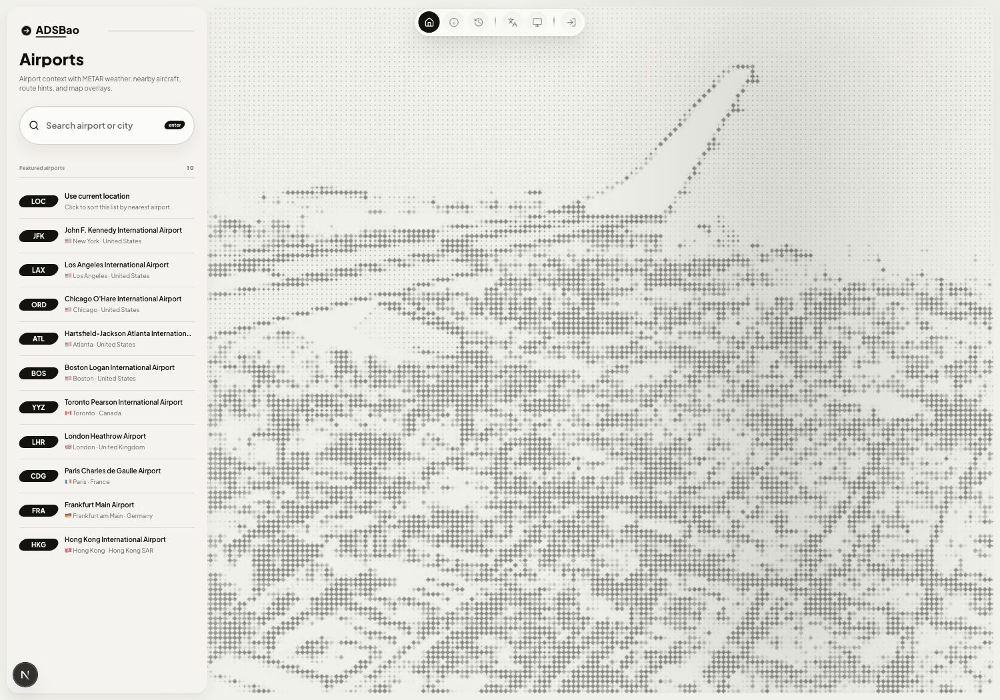
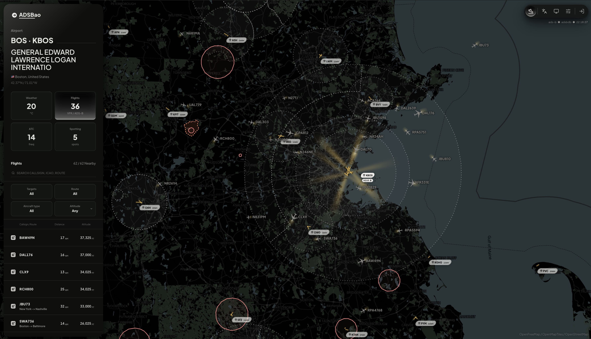
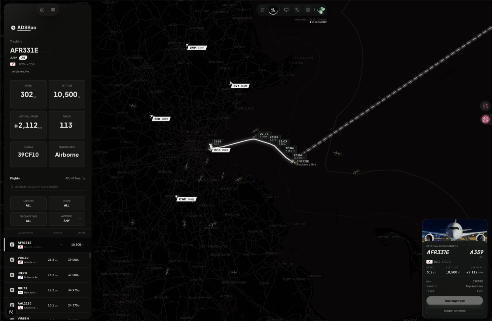

# ADSBao

ADSBao is a Vercel-first airport and flight tracking console. It combines global
airport search, METAR weather, nearby ADS-B traffic, route context, runway and
procedure overlays, and selected-flight trace views in a map-first HUD.

Current web app version: **1.5.1**. Runtime version strings and ADSBao
User-Agent values share `src/config/siteMeta.ts`; product history is rendered
from `src/config/changelog.ts` at `/changelog`.

<p align="center">
  
</p>

<p align="center">
  
  
</p>

## What It Does

- Search airports by ICAO, IATA, city, or airport name.
- Open airport dashboards with METAR-derived weather context, nearby traffic,
  nearby airports, distance rings, runway annotations, and map overlays.
- Track a callsign on `/aircraft/[callsign]` with live position state,
  telemetry, recent trace, route labels, nearby traffic, and last-known or
  fallback behavior when a signal drops.
- Resolve callsign routes through same-origin server routes, with adsbdb as the
  public route source and account-gated FlightAware fallback for enabled users.
- Accept temporary route correction feedback without turning every lookup into a
  database dependency.

## Stack

- **Frontend**: React, Next.js App Router, Tailwind CSS v4, DaisyUI, Lucide.
- **Maps**: Leaflet plus MapLibre-backed tiles and custom aircraft/runway layers.
- **Data layer**: OurAirports data persisted in Supabase and served through
  Next.js API routes.
- **Runtime**: Vercel Git deployments, same-origin proxy routes, Web Analytics,
  Speed Insights, and optional Sentry monitoring.
- **Auth and feature flags**: Clerk identity with Supabase-backed user feature
  flags for gated provider behavior.

## Data Paths

| Path | Source | Purpose |
|---|---|---|
| `/api/search` | Supabase OurAirports tables | Airport search |
| `/api/airport/[ident]` | Supabase OurAirports tables | Airport detail, runways, frequencies, navaids |
| `/api/proxy/metar/:icao` | AviationWeather | METAR weather context |
| `/api/proxy/aircraft/positions/:lat/:lon/:dist` | adsb.lol | Nearby aircraft |
| `/api/proxy/aircraft/callsign/:callsign` | ADS-B callsign providers | Tracked aircraft state |
| `/api/proxy/aircraft/trace/:hex` | ADS-B trace providers | Recent and full aircraft trace |
| `/api/proxy/flight-routes/callsign/:callsign` | adsbdb, route feedback, optional FlightAware fallback | Callsign route labels |
| `/api/proxy/procedures/:country/:icao` | FAA CIFP | US runway procedure overlays |
| `/api/proxy/airports/nearby` | AIRAC plus optional Supabase cache | Nearby airport overlays |

See `docs/architecture.md` for the current feature/API boundary conventions and
deployment topology.

## Local Development

### Prerequisites

- Node.js 24+
- pnpm

### Run The App

```bash
pnpm install
pnpm run dev
```

The local app runs at `http://localhost:3000` by default.

### Verify

```bash
pnpm test
pnpm build
```

`pnpm test` discovers every `*.test.ts` and `*.test.tsx` file and runs the critical mechanism
suite. UI and map behavior should be verified in the running app or in the
Vercel preview created for a pull request.

## Runtime Configuration

The app can boot with public same-origin providers, but production deployments
normally configure these variables:

| Variable | Purpose |
|---|---|
| `NEXT_PUBLIC_SITE_URL` | Canonical site URL for metadata and absolute links |
| `NEXT_PUBLIC_SUPABASE_URL` | Supabase project URL |
| `NEXT_PUBLIC_SUPABASE_PUBLISHABLE_KEY` | Public Supabase key for browser-safe reads and public caches |
| `SUPABASE_SERVICE_ROLE_KEY` or `SUPABASE_SECRET_KEY` | Server-side Supabase writes, imports, route feedback, and feature flags |
| `NEXT_PUBLIC_CLERK_PUBLISHABLE_KEY` | Clerk browser identity |
| `CLERK_SECRET_KEY` | Clerk server identity |
| `NEXT_PUBLIC_SENTRY_DSN` | Optional browser Sentry events |
| `SENTRY_DSN` | Optional server/edge Sentry events |
| `SENTRY_ORG`, `SENTRY_PROJECT`, `SENTRY_AUTH_TOKEN` | Optional production source-map upload |

Import or refresh airport directory data with:

```bash
node --env-file=.env --import tsx scripts/import-ourairports.ts
```

Manage Supabase-backed user feature flags with:

```bash
pnpm ff
```

## Project Structure

```text
ADSBao/
├── docs/                  # Architecture notes and repository screenshots
├── scripts/               # Data import and maintenance scripts
├── src/
│   ├── app/               # Next.js pages, API routes, API helpers, and DAOs
│   ├── components/        # JSX components grouped by screen/domain
│   ├── features/
│   │   ├── aircraft/      # Aircraft callsign, photos, positions, trace, and preview logic
│   │   ├── airport/       # Airport directory, explorer, map, nearby, procedures, and wiki logic
│   │   ├── aviation/      # Shared aviation clients and route mechanisms
│   │   ├── weather/       # Weather models and METAR/local-weather integration
│   │   ├── about/         # About-page view models
│   │   └── app-shell/     # Theme, locale, auth, and feature-flag helpers
│   ├── hooks/             # Shared React hooks
│   ├── config/            # Runtime, release, map, weather, and provider configuration
│   ├── constants/         # Shared product constants
│   ├── data/              # Static fallback and metadata files
│   └── utils/             # Cross-feature pure helpers
├── package.json
└── vercel.json
```

JSX belongs under `src/components/**`. Feature mechanisms, models, provider
clients, and utilities live with their owning feature domain as plain `.ts`
modules. API persistence boundaries stay under `src/app/api/dao`, and
route-handler-only helpers stay under `src/app/api/_shared`.

## Release Policy

Vercel deploys every push to `main`, but deployments are not product releases.
Product versions are bumped only when user-visible product scope changes,
production behavior changes, or fixes should be documented in
`src/config/changelog.ts`.
