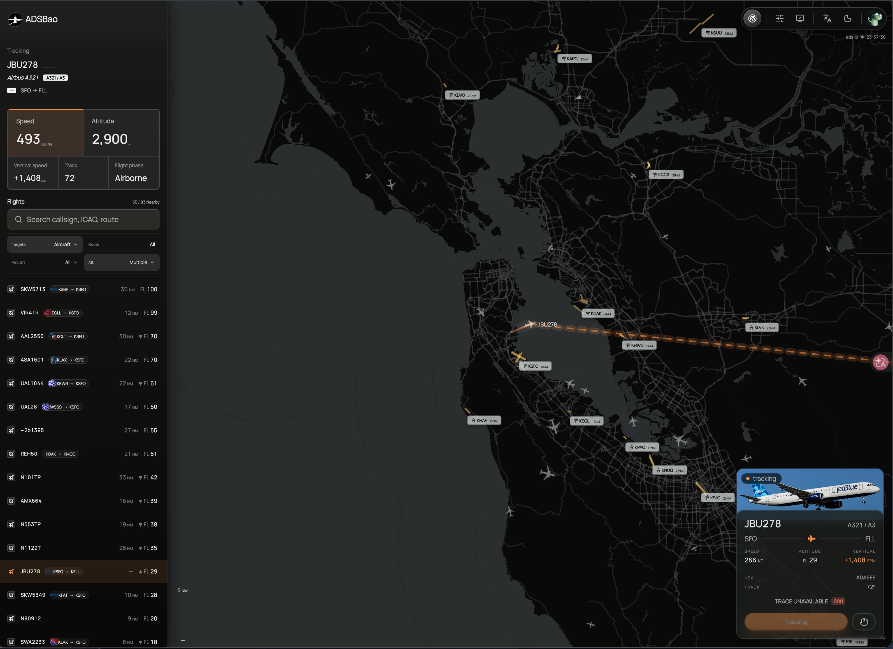
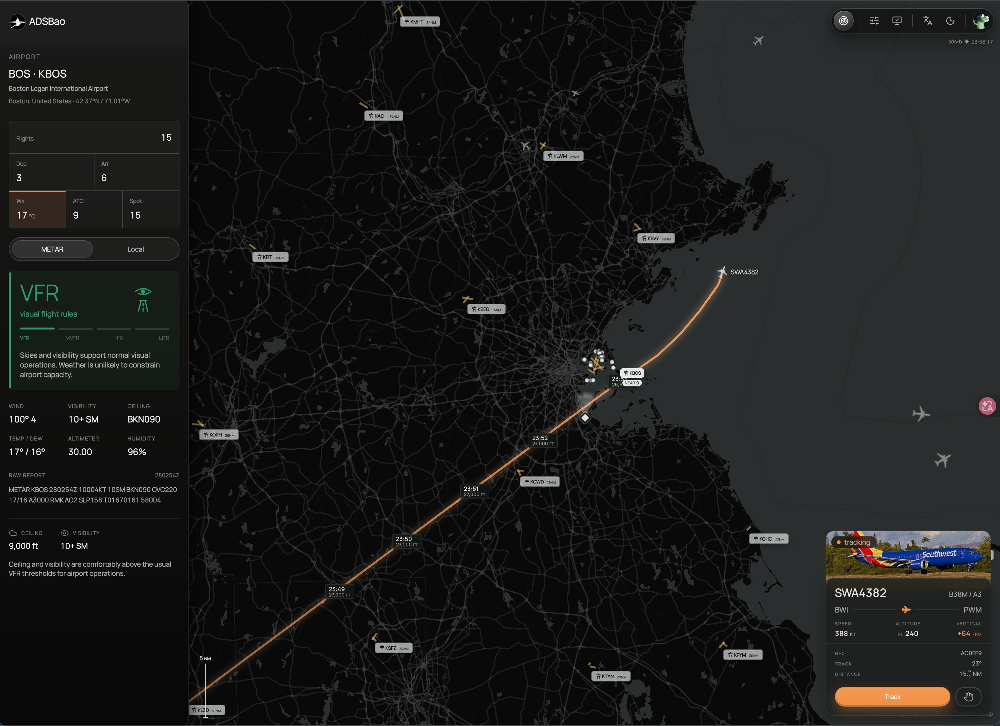

# ADSBao

<p align="center">
  <strong>Airport weather, live ADS-B traffic, and flight route context in a map-first aviation dashboard.</strong><br />
  Search airports by ICAO, IATA, city, or name, then explore METAR weather,
  nearby aircraft, runways, airspace overlays, route hints, and selected-flight
  traces from one web console.
</p>

<p align="center">
  <a href="https://adsbao.dev"><strong>Open ADSBao</strong></a>
  ·
  <a href="https://adsbao.dev/airport/KBOS">KBOS airport map</a>
  ·
  <a href="https://adsbao.dev/about">Data sources</a>
  ·
  <a href="https://github.com/orriduck/ADSBao">GitHub</a>
</p>

<p align="center">
  
</p>

<p align="center">
  
  
</p>

<p align="center">
  
</p>

## Why ADSBao

ADSBao is an open-source aviation web app for people who want airport context
and live flight-tracking context without jumping between separate tools. It is
useful for plane spotting, airport discovery, weather checks, route context,
and exploring public aviation data in a visual map interface.

ADSBao is not a certified navigation product. Treat all weather, traffic,
airspace, runway, route, and map data as reference context only.

## Airport And Flight Tracking Features

- **Airport search**: Find airports by ICAO, IATA, city, or airport name.
- **Airport weather dashboard**: Read METAR-derived flight rules, wind,
  visibility, ceiling, pressure, local weather, and raw METAR text.
- **Live ADS-B traffic map**: See nearby aircraft around the airport with
  altitude, speed, heading, route hints, and aircraft-type display.
- **Runway and aviation overlays**: Explore runway geometry, taxiway and apron
  detail, range rings, nearby airports, airspaces, reporting points, obstacles,
  frequencies, and navaids where data is available.
- **Plane-spotting locations**: Surface curated photo and spotting points
  around the airport on the map so spotters can plan where to shoot, with
  source attribution where available.
- **Flight tracker pages**: Open `/aircraft/[callsign]` to follow a selected
  aircraft with live position state, telemetry, recent trace, nearby traffic,
  route labels, and last-known behavior when a signal drops.
- **Route lookup and correction feedback**: Resolve callsign routes through
  same-origin server routes, with adsbdb as the public route source and
  account-gated FlightAware fallback for enabled users.
- **Browser-agent tools (WebMCP)**: Expose a small browser-native WebMCP
  surface so in-browser agents can search airports, open airport and aircraft
  pages, and read the current page context. Browsers without WebMCP simply skip
  it and the normal UI stays the source of truth.

## Live Examples

- Production site: [adsbao.dev](https://adsbao.dev)
- Airport traffic dashboard: [KBOS on ADSBao](https://adsbao.dev/airport/KBOS)
- Featured indexed airport pages: [KLAX](https://adsbao.dev/airport/KLAX),
  [KJFK](https://adsbao.dev/airport/KJFK),
  [KORD](https://adsbao.dev/airport/KORD),
  [KSFO](https://adsbao.dev/airport/KSFO), and
  [KSEA](https://adsbao.dev/airport/KSEA)
- Flight tracker route pattern: `https://adsbao.dev/aircraft/[callsign]`

## Data Sources And API Paths

ADSBao combines public aviation weather, ADS-B aircraft positions, airport
directory data, map tiles, and route context behind one same-origin Railway Go
service. The Go data-service serves the Vite SPA, `/api/**` routes, `/ws`, and
Better Stack telemetry from the same deployment. See
[docs/architecture.md](docs/architecture.md) for the current feature/API
boundary conventions and deployment topology.

High-frequency ADS-B aircraft updates flow through the same Go WebSocket
service. In production the browser normally uses same-origin `/ws`; set
`VITE_ADSBAO_REALTIME_URL` only when pointing a local frontend at a different
data-service origin.

| Path | Source | Purpose |
|---|---|---|
| `/api/search` | OpenAIP Core API | Airport search |
| `/api/airport/[ident]` | OpenAIP Core API + OurAirports static facilities + Postgres augmentation | Airport detail, runways, frequencies, navaids, airspaces, reporting points, obstacles, runway map, and plane-spotting locations |
| `/api/proxy/metar/:icao` | AviationWeather | METAR weather context |
| `/api/proxy/aircraft/positions/:lat/:lon/:dist` | adsb.lol, airplanes.live, adsb.fi (failover) | Nearby aircraft |
| `/api/proxy/aircraft/callsign/:callsign` | adsb.lol, airplanes.live, adsb.fi (failover) | Tracked aircraft state |
| `/api/proxy/aircraft/trace/:hex` | adsb.lol, airplanes.live, adsb.fi (failover) | Recent and full aircraft trace |
| `/api/proxy/flight-routes/callsign/:callsign` | adsbdb, route feedback, optional FlightAware fallback | Callsign route labels |
| `/api/proxy/airports/nearby` | OpenAIP Core API | Nearby airport overlays |

## Stack

- **Frontend**: React, Vite, React Router, Tailwind CSS v4, and Lucide.
- **Maps**: Leaflet plus MapLibre-backed tiles, with a single-canvas aircraft
  renderer and custom runway/taxiway and night-lighting layers.
- **Data layer**: OpenAIP served through same-origin Go API routes with
  Railway Postgres persistence for static augmentation tables and user-scoped
  settings. OurAirports augments runway threshold geometry, ATC frequencies,
  and navaid coverage.
- **Runtime**: One Railway service built from the root `Dockerfile`. The Go
  binary serves the Vite `dist/` assets, same-origin APIs, WebSocket traffic,
  health/debug endpoints, provider fallback, and Better Stack telemetry.
- **Auth and feature flags**: Clerk identity with Postgres-backed user feature
  flags for gated provider behavior.

## Local Development

### Prerequisites

- Node.js 22+
- pnpm
- Go 1.26+ for `services/data-service`

### Run The App

```bash
pnpm install
pnpm run dev
```

The local app runs at `http://localhost:3000` by default.

Agent-oriented local debug shortcut:

```bash
pnpm debug:local
pnpm debug:local:service
```

`debug:local` adopts or starts the Vite server and writes a local health
snapshot to `.codex-tmp/local-debug/latest.md`. `debug:local:service` also
starts the Go data-service on the local Vite proxy target.

### Run The Railway Service Locally

Build the frontend, then run the Go service with `STATIC_DIR` pointed at Vite's
output:

```bash
pnpm run build
cd services/data-service
go test ./...
STATIC_DIR=/Users/ruyyi/Devs/ADSBao/dist PORT=8080 go run ./cmd/adsbao-data-service
```

For a split local setup, keep Vite on port 3000 and point it at a local Go
service:

```bash
VITE_ADSBAO_LOCAL_API_ORIGIN=http://localhost:8081 pnpm run dev
cd services/data-service
PORT=8081 go run ./cmd/adsbao-data-service
```

Service health and channel debug endpoints:

```bash
curl http://localhost:8080/health
curl http://localhost:8080/debug/channels
```

### Verify

```bash
pnpm test
pnpm build
cd services/data-service && go test ./...
```

`pnpm test` discovers every `*.test.ts` and `*.test.tsx` file and runs the
critical mechanism suite. UI and map behavior should be verified in the running
app or against the Railway deployment.

## Runtime Configuration

The app can boot with public same-origin providers, but production deployments
normally configure these variables:

| Variable | Purpose |
|---|---|
| `ADSBAO_SITE_URL` / `VITE_SITE_URL` | Canonical site URL for metadata and absolute links |
| `ADSBAO_DATABASE_URL` / `DATABASE_URL` | Server-side Postgres connection string for DAO reads/writes, imports, route feedback, feature flags, and map settings |
| `PGSSLMODE` | Optional Postgres SSL mode. Set `disable` only for local non-SSL databases |
| `PGPOOL_MAX` | Optional Postgres pool size cap for server route handlers and import scripts |
| `VITE_CLERK_PUBLISHABLE_KEY` | Clerk browser identity |
| `CLERK_SECRET_KEY` | Clerk server identity |
| `CLERK_JWKS_URL` | Optional Clerk JWT public-key endpoint override; normally inferred from the token issuer |
| `CLERK_API_BASE_URL` | Optional Clerk Backend API base URL override |
| `VITE_ADSBAO_REALTIME_URL` | Optional override for the realtime WebSocket URL; production normally uses same-origin `/ws` |
| `ADSBAO_REALTIME_AUTH_SECRET` | HMAC secret used by the Go service to authorize FlightAware realtime subscriptions |
| `BETTERSTACK_METRICS_SOURCE_TOKEN` | Optional Better Stack source token for backend custom metrics |
| `BETTERSTACK_METRICS_ENDPOINT` | Optional Better Stack metrics source endpoint, usually `https://<metrics-source-host>/metrics` |
| `BETTERSTACK_LOG_SOURCE_TOKEN` | Optional Better Stack source token for backend structured logs |
| `BETTERSTACK_LOGS_ENDPOINT` | Optional Better Stack logs source endpoint, usually `https://<logs-source-host>` |
| `BETTERSTACK_SERVICE_NAME` | Optional Better Stack service name. Defaults to `adsbao-data-service` |
| `METRICS_REPORT_INTERVAL_MS` | Optional dynamic metrics flush interval for the data-service; defaults to `30000` |
| `LOGS_REPORT_INTERVAL_MS` | Optional backend log flush interval for the data-service; defaults to `5000` |

Manage Postgres-backed user feature flags with:

```bash
pnpm ff
```

Import runway threshold geometry with:

```bash
pnpm import:runways
```

Import OurAirports ATC frequency and navaid augmentation data with:

```bash
pnpm import:facilities
```

Import OurAirports airport names with:

```bash
pnpm import:airports
```

The import scripts use `ADSBAO_DATABASE_URL`; do not expose database connection
strings through `VITE_*` variables.

## Project Structure

```text
ADSBao/
├── .github/workflows/     # GitHub automation
├── docs/                  # Architecture notes and repository screenshots
├── scripts/               # Data import and maintenance scripts
├── services/
│   └── data-service/      # Go API, static SPA, ADS-B polling, and WebSocket service
├── src/
│   ├── App.tsx            # React Router route table
│   ├── main.tsx           # Vite browser entrypoint
│   ├── components/        # JSX components grouped by screen/domain
│   ├── features/
│   │   ├── aircraft/      # Aircraft callsign, photos, positions, trace, and preview logic
│   │   ├── airport/       # Airport directory, explorer, map, nearby, OpenAIP, and wiki logic
│   │   ├── aviation/      # Shared aviation clients and route mechanisms
│   │   ├── weather/       # Weather models and METAR/local-weather integration
│   │   ├── about/         # About-page view models
│   │   ├── app-shell/     # Theme, locale, auth, and feature-flag helpers
│   │   └── webmcp/        # Browser-native WebMCP tool registration for agents
│   ├── hooks/             # Shared React hooks
│   ├── config/            # Runtime, release, map, weather, and provider configuration
│   ├── constants/         # Shared product constants
│   ├── data/              # Static fallback and metadata files
│   └── utils/             # Cross-feature pure helpers
├── Dockerfile             # Railway single-service build
├── package.json
└── railway.json
```

JSX belongs under `src/components/**`. Feature mechanisms, models, provider
clients, and utilities live with their owning feature domain as plain `.ts`
modules. API persistence boundaries stay under `src/server/dao`, and
HTTP helper utilities stay under `src/server/http`.

## Data Service Deployment

The public ADSBao app deploys to Railway as one service from the repository
root. The root `Dockerfile` builds the Vite frontend, compiles
`services/data-service`, copies `dist/` into the runtime image, and starts the
Go binary. The service exposes `/health`, `/debug/channels`, `/api/**`, `/ws`,
and the static SPA fallback. It pushes HTTP, external provider, database,
WebSocket, scheduler, and dynamic channel metrics plus structured backend logs
to Better Stack when the `BETTERSTACK_*` source settings are configured.
Custom metric and log payloads are queryable by `service.name`,
`adsbao.service`, and low-cardinality dimensions such as route, provider,
operation, status class, and channel type.

Railway setup:

1. Create or open a Railway project and add the GitHub repo.
2. Use the repository root as the Railway root directory.
3. Let Railway use the root `railway.json` and `Dockerfile`.
4. Generate a public Railway domain for the service.
5. Set `ADSBAO_REALTIME_AUTH_SECRET` when FlightAware realtime subscriptions
   are enabled.
6. If FlightAware private access is enabled, deploy the private FlightAware
   endpoint as a separate protected service and set
   `FLIGHTAWARE_SERVICE_BASE_URL` to its reachable origin. A same-project
   Railway `railway.internal` URL works, but a separate Railway project can
   be used when the endpoint is exposed through protected HTTPS and guarded
   by `FLIGHTAWARE_SERVICE_TOKEN`.
7. Set the Better Stack metrics and logs source token/endpoint variables on
   Railway to enable backend metric and log ingest.

Railway handles production deployment through its GitHub integration. The
service should be configured with root directory `.`, config file
`/railway.json`, and public app URL `https://<railway-domain>`.
See [docs/data-service-deployment.md](docs/data-service-deployment.md) for the
deployment and smoke-check runbook.

## Release Policy

Runtime version strings and ADSBao User-Agent values share
`src/config/siteMeta.ts`; product history is rendered from
`src/config/changelog.ts` at `/changelog`.

Railway can deploy every push to `main`, but deployments are not product releases.
Product versions are bumped only when user-visible product scope changes,
production behavior changes, or fixes should be documented in
`src/config/changelog.ts`.
